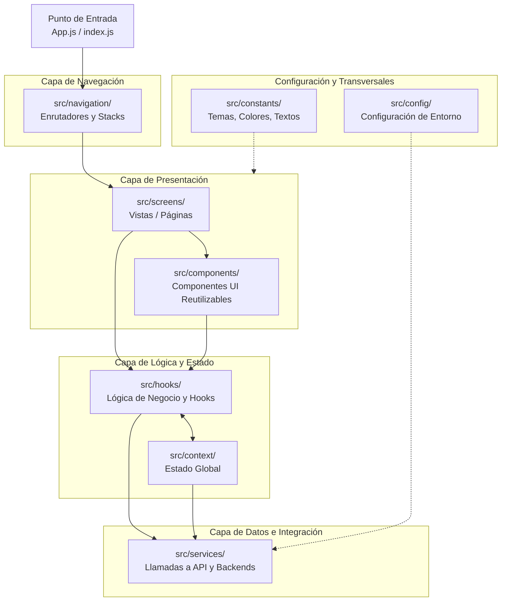

# Arquitectura de TaskLife

Este documento describe la arquitectura de alto nivel de **TaskLife** y cómo se mapea la estructura de directorios del proyecto a las diferentes capas de la aplicación. Esta guía está diseñada para facilitar la comprensión del sistema y permitir la generación de diagramas visuales.

## Diagrama de Arquitectura (Visual)

A continuación se presenta un diagrama [Mermaid](https://mermaid.js.org/) que modela la interacción entre las diferentes capas del sistema basado en la estructura de carpetas:

## Mapeo de Estructura de Directorios

La estructura del código fuente (`src/`) se divide conceptualmente en las siguientes áreas de responsabilidad:

### 1. Punto de Entrada
* **`App.js` / `index.js`**: Son los archivos raíz de la aplicación en React Native / Expo. Se encargan de inicializar la aplicación, proveer los contextos globales y montar el sistema de navegación.

### 2. Capa de Navegación (`src/navigation/`)
* **Responsabilidad**: Controlar el flujo entre pantallas.
* **Contenido**: Aquí residen los *Navigators* (Stack, Tab, Drawer, etc.) de React Navigation. Conecta el Entry Point con la Capa de Presentación.

### 3. Capa de Presentación (`src/screens/` y `src/components/`)
* **`src/screens/`**: Contiene las vistas completas de la aplicación (ej. `HomeScreen`, `LoginScreen`). Estas pantallas se encargan de orquestar componentes más pequeños y gestionar el estado local específico de la vista.
* **`src/components/`**: Componentes visuales reutilizables (Botones, Tarjetas, Modales). Son principalmente "tontos" (dumb components) y reciben su información vía *props*.

### 4. Capa de Lógica y Estado Global (`src/hooks/` y `src/context/`)
* **`src/hooks/`**: Ganchos (hooks) personalizados de React. Aquí se abstrae la lógica de negocio y se separa de la interfaz de usuario, haciendo el código de las pantallas más limpio.
* **`src/context/`**: Manejo de estado global usando la API de Contexto de React (React Context). Almacena información que debe estar disponible a lo largo de toda la aplicación (ej. sesión de usuario, preferencias, carritos).

### 5. Capa de Datos e Integración (`src/services/`)
* **Responsabilidad**: Comunicación con el mundo exterior.
* **Contenido**: Clientes HTTP (ej. Axios, Fetch), llamadas a APIs REST/GraphQL, interacción con Firebase, almacenamiento local (AsyncStorage), entre otros. Ningún componente debe llamar a una API directamente sin pasar por un servicio.

### 6. Capa Transversal (`src/config/` y `src/constants/`)
* **`src/config/`**: Archivos de configuración para la inicialización de herramientas de terceros, variables de entorno y configuraciones generales.
* **`src/constants/`**: Valores estáticos o "hardcodeados" que se reutilizan, como paletas de colores (`colors.js`), tamaños (`metrics.js`), o cadenas de texto.
